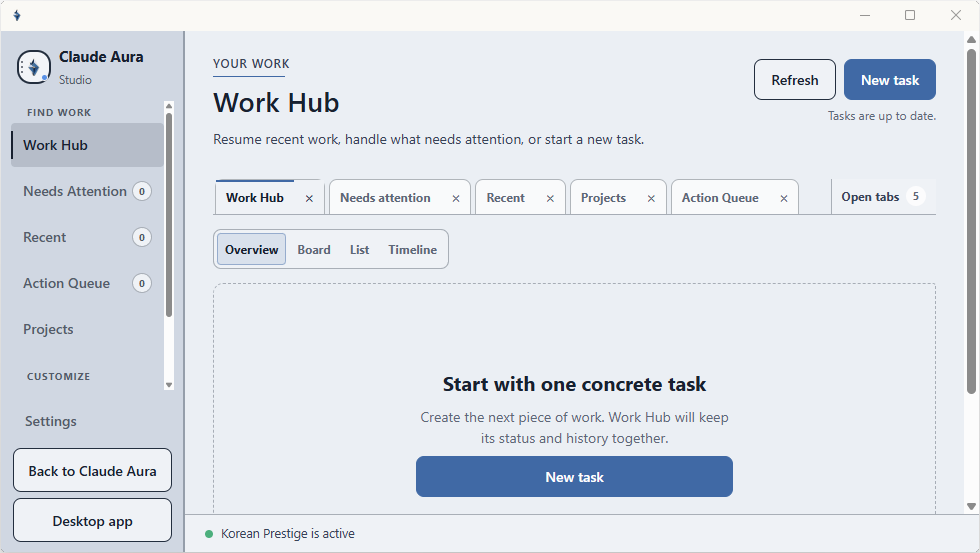

<a id="readme-top"></a>

# Claude Aura

<p align="center">
  <a href="../README.md">English</a> ·
  <a href="./README.zh-CN.md">简体中文</a> ·
  <a href="./README.zh-HKTW.md">繁體中文</a> ·
  <a href="./README.hi.md">हिन्दी</a> ·
  <a href="./README.es.md">Español</a> ·
  <a href="./README.fr.md">Français</a> ·
  <a href="./README.id.md">Bahasa Indonesia</a> ·
  <a href="./README.ja.md">日本語</a> ·
  <a href="./README.ko.md">한국어</a> ·
  <a href="./README.pt-BR.md">Português (Brasil)</a> ·
  <a href="./README.de.md">Deutsch</a> ·
  <a href="./README.it.md">Italiano</a> ·
  <a href="./README.vi.md">Tiếng Việt</a> ·
  <a href="./README.pl.md">Polski</a> ·
  <strong>Türkçe</strong>
</p>

<p align="center">
  <strong>Windows’ta canlı Claude web sitesini yerel ve geri alınabilir bir tema ile kişiselleştirin.</strong><br>
  Yerel temalar · Claude Desktop’ı yama yok · Tek tıkla orijinal görünüme dön
</p>

<p align="center">
  <a href="#getting-started">Başlangıç</a> ·
  <a href="#theme-showcase">Temalara göz at</a> ·
  <a href="#create-a-custom-theme">Tema oluştur</a> ·
  <a href="../docs/TROUBLESHOOTING.md">Sorun giderme</a> ·
  <a href="../SECURITY.md">Güvenlik</a>
</p>

<p align="center">
  <a href="https://github.com/kaihuang1425/claude-aura"><strong>Claude Aura sizin için faydalıysa, GitHub'da projeye yıldız verin.</strong></a>
</p>

<p align="center">
  <a href="../README.md#feature-tour"></a><br>
  <sub>Actual installed Aura capture · Themes · Pet · Tabs · Work Hub</sub>
</p>


> **Independent project.** Claude Aura bağımsız bir projedir; Anthropic PBC ile bağlı,
> desteklenmiş, sponsorlu, onaylanmış veya onaylanmış değildir. Aura canlı `claude.ai`
> sitesini görüntüler; Claude’i sağlamaz ve Anthropic’in yüklü uygulamalarını değiştirmez.
> Claude, Anthropic ve ilişkili adlar/markalar Anthropic PBC’ye aittir. Proje lisansı bu
> varlıklara ilişkin hakları vermez.

<details>
<summary><strong>Halka açık veya ticari sürüm için marka notu</strong></summary>

> **Halka açık veya ticari yayın öncesi:** Anthropic’in güncel
> [Trademark Guidelines](https://www.anthropic.com/legal/trademark-guidelines) belgesi,
> ad ve marka için önceden onay gerektirir ve değiştirilmiş işaretleri yasaklar. Bir
> feragatname izin anlamına gelmez. **Claude Aura** adı veya temalı Claude wordmark’ini
> içeren bir sürüm için yazılı izin ve uygun hukuki inceleme gerekir.

</details>

<a id="contents"></a>
<details>
<summary><strong>İçindekiler</strong></summary>

- [Claude Aura](#claude-aura)
  - [Neden Aura](#why-aura)
  - [Hızlı başlangıç](#quick-start)
    - [Gereksinimler](#requirements)
    - [Kurulum](#installation)
    - [Kaldırma](#uninstall)
  - [Tema vitrini](#theme-showcase)
    - [Japanese Film Editorial](#japanese-film-editorial)
    - [Japanese Idol](#japanese-idol)
    - [Korean Idol](#korean-idol)
  - [Aura’yı kullanma](#use-aura)
  - [Özel tema oluşturma](#create-a-custom-theme)
  - [Aura nasıl çalışır](#how-aura-works)
  - [Güvenlik ve gizlilik](#safety-and-privacy)
  - [Yol haritası](#roadmap)
  - [Destek ve dokümantasyon](#support-and-documentation)
    - [Dokümantasyon haritası](#documentation-map)
  - [Hayırsever destek](#charitable-support)
  - [Lisans ve bildiriler](#license-and-notices)
  - [Teşekkürler](#acknowledgments)

</details>

<a id="about-claude-aura"></a>
<a id="why-aura"></a>
## Neden Aura

- **Canlı Claude sitesini kullanır.** Aura, gerçek arayüzü ve yerel kontrolleri yeniden
yapılmış bir ekranla değiştirmek yerine korur.
- **Değişikliği yerel ve geri alınabilir tutar.** Claude Desktop’a yama uygulamadan
  yerel stil uygular ve **Original look** ile Aura’nın sunum katmanını tek bir tıklamayla kaldırır.
- **Sekiz yerleşik tema ile başlayın.** Her biri, kişiselleştirilmiş bir çalışma alanı için
  stabil ve salt okunur başlangıç noktasıdır.
- **Orijinalleri değiştirmeden tema oluşturun.** Claude Aura Studio, yerel renkler,
  tipografi, şekiller, efektler ve sanat eserleriyle çalışır.

Aura 0.3 şu anda yalnızca canlı web sitesini temalandırır. Henüz Claude Desktop Code veya
Claude Code terminalını temalamaz ve normal Aura sohbeti yerel proje erişimi kazanmaz. Nihai
sürüme geçmeden önce Aura Code, canlı `claude.ai/code` üzerinde temalı resmi bir
[Remote Control](https://code.claude.com/docs/en/remote-control) oturumu ile yayın blokunu aşmalıdır;
aynı terminal-theme dışa aktarımı, Claude Desktop’ı yama yapmadan kısıtlı ortamlarda kapsar.

<details>
<summary><strong>Tüm kabiliyetler ve hariç tutulanlar</strong></summary>

Claude Aura, gerçek `claude.ai` web sitesini Microsoft Edge WebView2’ye ait ayrı bir pencerede
açar ve yerel bir görsel tema uygular. Amaç, Claude Desktop’ı yamalamadan veya
canlı arayüzü ekran görüntüsüyle değiştirmeden daha kişisel bir alan isteyenleri desteklemektir.

| Aura yapar | Aura yapmaz |
| --- | --- |
| Canlı `claude.ai` arayüzünü WebView2’de yükler | Claude’ı yeniden oluşturulmuş arayüzle değiştirir |
| Geri alınabilir yerel stil uygular | Claude Desktop, `app.asar`, Windows paketleri veya kod imzalarını yamalar |
| Sekiz yerleşik tema sağlar | Claude hesapları, sohbetler, API anahtarları, modeller veya sağlayıcı ayarlarını değiştirir |
| Yerel özel temalar için Studio sağlar | Kendisini Anthropic ürünü veya resmi tema sistemi olarak gösterir |
| Uygulama içinde **Original look** sunar | Stil kapalıyken kaydedilmiş temaları siler |

</details>

<p align="right">(<a href="#readme-top">başa dön</a>)</p>
<a id="getting-started"></a>
## Hızlı başlangıç

### Gereksinimler

- Windows 10 veya Windows 11
- İnternet erişimi ve Claude hesabı
- [Node.js 22 veya üstü](https://nodejs.org/en/download)
- [Microsoft Edge WebView2 Runtime](https://developer.microsoft.com/en-us/microsoft-edge/webview2/)

WebView2 çoğu güncel Windows bilgisayarda bulunur. Aura tarayıcı penceresini açamazsa
Evergreen WebView2 Runtime’ı kurun veya onarın ve yeniden deneyin.
Claude Desktop isteğe bağlıdır ve ayrı bir uygulama olarak kalır.

### Yükleme

[Son sürümü](https://github.com/kaihuang1425/claude-aura/releases) açın ve bu yollardan birini seçin. Her ikisi de mevcut Windows hesabı için aynı sürümü yükler.

| Path | Use it when | Download |
| --- | --- | --- |
| **Unsigned Setup** | Daha basit, yönlendirmeli kurucu isterseniz ve Windows onu normal şekilde açıyorsa | `Claude-Aura-Setup-v<version>-UNSIGNED.exe` ile `.sha256` ve `.manifest.json` |
| **ZIP + CMD fallback** | Windows, unsigned Setup için uyarı verip engelliyorsa veya okunabilir kaynak betikler tercih ediyorsanız | `claude-aura-v<version>.zip` ile onun `.sha256` dosyası |

#### Path 1 ??Unsigned Setup

1. **Assets** altında `-UNSIGNED.exe`, `.sha256` ve `.manifest.json` dosyalarını indirin. GitHub’in otomatik ürettiği **Source code** arşivlerini kullanmayın.
2. Setup dosyasının SHA-256 değerini iki yardımcı dosyayla karşılaştırın. Herhangi bir değer farklıysa indirmeyi durdurun ve dosyaları silin.
3. Windows bu yükleyicinin publisher'ını doğrulayamaz çünkü geliştiricinin code-signing sertifikası yoktur. Windows uyarı verirse veya engellerse, uyarıyı atlamayın; Path 2 kullanın.
4. Normal açılıyorsa Setup’ı takip edin. Node.js ve WebView2'yi kontrol eder, `%LOCALAPPDATA%\ClaudeAura` altında kurar, **Installed apps** kaydı ve kısayollar ekler, ardından Aura'yı açar.

#### Path 2 ??ZIP + CMD fallback

1. **Assets** altında `claude-aura-v<version>.zip` ve eşleşen `.sha256`yi indirin. GitHub’in otomatik ürettiği **Source code** arşivlerini kullanmayın.
2. ZIP'in SHA-256 değerini karşılık gelen dosyayla karşılaştırın. Değerler farklıysa durun ve her iki dosyayı da silin.
3. **Extract all** seçeneğini seçin. Çıkarılan `claude-aura` klasöründe **Install Claude Aura.cmd** dosyasına çift tıklayın. ZIP önizlemesinden çalıştırmayın.
4. Okunabilir CMD/PowerShell kurucusu Node.js ve WebView2'yi kontrol eder, Aura'yı kurar, kısayolları oluşturur ve açar. Bu yol bir Authenticode publisher kimliği içermez ve **Installed apps** girdisi eklemez.

Herhangi bir yoldan sonra, `claude.ai` isterse Aura içinde oturum açın. Floating Aura düğmesine tıklayın, **Open Studio**'yu seçin, ardından **Themes**'i seçin.

`-UNSIGNED` içermeyen bir `Claude-Aura-Setup-v<version>.exe` farklı, imzalı bir yoldur ve bu release notlarında adı geçen publisher'ı göstermelidir. `-UNSIGNED-DEV.exe` ile biten bir asset asla kamuya açık değildir.

Kurulum Claude Desktop'ı patch etmez veya değiştirmez.

<details>
<summary><strong>Installer behavior, application location, and uninstall</strong></summary>

Her iki yol da yönetici istemi olmadan çalışır, önkoşulları doğrular ve Aura'nın korunmuş app-tree swap işlemini gerçekleştirir. Uygulama dosyaları aşağıya kurulmaktadır:

```text
%LOCALAPPDATA%\ClaudeAura\app
```

Start menüsünde ve masaüstünde **Claude Aura**, **Claude Aura Studio** ve kaldırma kısayollarını oluşturur. Tema ayarları ve oturum açma verileri uygulamadan ayrı saklandığından Aura'yı yeniden yüklemek bunları sessizce değiştirmez. Native Setup bir **Installed apps** girdisi ve native uninstaller ekler; ZIP/CMD yolu ise kaynak betik kaldırma kısayolunu korur.

Geliştiriciler repository'yi klonlayıp yerel inceleme için açıkça adlandırılmış unsigned development installer derleyebilir. Bu, açıkça işaretlenmiş genel unsigned Setup'tan farklıdır. Build komutları, pinned compiler, doğrulama kapıları ve yayın kontrol listesi
[Windows installer guide](../docs/WINDOWS_INSTALLER.md)'da belgelenmiştir.

### Uninstall

Önce floating Aura düğmesine sağ tıklayıp **Exit Claude Aura** seçin.
ZIP kurulumunda, **Start > Claude Aura > Uninstall Claude Aura** açın veya çıkarılmış bir release'de **Uninstall Claude Aura.cmd**'ye çift tıklayın. Herhangi bir native Setup için ayrıca **Settings > Apps > Installed apps > Claude Aura > Uninstall** da kullanılabilir. `.cmd` girdisi, mevcutsa kayıtlı native uninstaller'a devredilir. Uninstaller, Aura hâlâ açıksa devam etmez.

Varsayılan olarak, uninstall Aura uygulamasını ve kısayolları kaldırır ama daha sonra yeniden yükleme için yerel tema ayarlarını ve Aura'nın ayrı WebView oturum açma profilini korur. Uninstaller, bu klasörleri silmeden önce de onay ister. Bu isteğe bağlı silme işlemi Aura'nın yerel oturum açma oturumunu kaldırır; Claude Desktop'ı, kullanıcının Anthropic hesabını veya sunucu tarafındaki hesap verisini asla kaldırmaz.

</details>

<p align="right">(<a href="#readme-top">başa dön</a>)</p>

<a id="theme-showcase"></a>
## Tema vitrini

Aura’nın görsel sistemi aşağıda New chat ve Conversation referanslarıyla gösterilir.
Öne çıkan Japanese Film Editorial New chat önizlemesi bu README’nin üstünde yer alır.

**Default · Japanese Film Editorial · Korean Prestige · Cartoon Studio · Anime Twilight · Study Library · Japanese Idol · Korean Idol**

### Japanese Film Editorial

Sıcak kağıt dokusu, kömür siyahı, mat çivit mavisi ve kontrollü kiraz kırmızısı.

<details>
<summary>Conversation görünümüne bakın</summary>

<p align="center">
  <br>
  <sub>Koyu · Conversation · kullanıcı tarafından sağlanan dokümantasyon önizlemesi</sub>
</p>

</details>

### Japanese Idol

Sıcak krem, pembemsi şeftali, gül, sedefi leylak ve ince kurdele detayları.

<p align="center">
  <br>
  <sub>Parlak · Yeni sohbet · kullanıcı tarafından sağlanan dokümantasyon önizlemesi</sub>
</p>

<details>
<summary>Conversation görünümüne bakın</summary>

<p align="center">
  <br>
  <sub>Parlak · Conversation · kullanıcı tarafından sağlanan dokümantasyon önizlemesi</sub>
</p>

</details>

### Korean Idol

Soğuk beyaz, periwinkle, holografik gümüş ve yapılandırılmış müzik camı.

<p align="center">
  <br>
  <sub>Parlak · Yeni sohbet · kullanıcı tarafından sağlanan dokümantasyon önizlemesi</sub>
</p>

<details>
<summary>Conversation görünümüne bakın</summary>

<p align="center">
  <br>
  <sub>Parlak · Conversation · kullanıcı tarafından sağlanan dokümantasyon önizlemesi</sub>
</p>

</details>

<details>
<summary><strong>Referans durumu ve yeniden kullanım sınırları</strong></summary>

> **Referans durumu:** Bu kullanıcı tarafından sağlanan görseller, hedef görsel yönü iletir.
> İçlerinde açıklayıcı arayüz içerikleri olabilir; canlı `claude.ai` davranışının güncel
> kanıtı veya canlı kabul kanıtı değildir. Tema arka planı değildir, Aura’ya aktarılamaz ve
> yayıncı kurulumlardan hariç tutulmuştur.
>
> Önizlemeler üçüncü taraf ürün arayüzü, isim/marka ve insan benzeri portre çalışmaları
> içerebilir. Bunların dahil edilmesi yeniden kullanım hakkı vermez. Yayım veya yeniden dağıtım
dan önce ilgili arayüz, marka, sanat ve benzeri hakları doğrulayın.

</details>

<a id="built-in-themes"></a>
<details>
<summary><strong>Tüm yerleşik temalar ve sabit kimlikler</strong></summary>

Aura sekiz yerleşik temayı sabit bir sırayla sunar:

| # | Tema | Sabit ID |
| ---: | --- | --- |
| 1 | Default | `default` |
| 2 | Japanese Film Editorial | `japanese-film-editorial` |
| 3 | Korean Prestige | `korean-prestige` |
| 4 | Cartoon Studio | `cartoon-studio` |
| 5 | Anime Twilight | `anime-twilight` |
| 6 | Study Library | `study-library` |
| 7 | Japanese Idol | `japanese-idol` |
| 8 | Korean Idol | `korean-idol` |

Yerleşik temalar salt okunur. Studio, düzenlemek isterseniz düzenlenebilir bir kopya üretir.

</details>

<p align="right">(<a href="#readme-top">başa dön</a>)</p>

<a id="use-aura"></a>
## Aura’yı kullanma

| Eylem | Ne yapar |
| --- | --- |
| Kayan Aura düğmesine tıkla | Claude Aura Studio’yu açar |
| **Themes** | Yerleşik galeriyi açar ve seçili temayı kaydeder |
| **Create a theme** | Aura tarafından sahip olunan bir özel tema oluşturur veya düzenler |
| **Personal wallpaper > Choose wallpaper** | Etkin temadan bağımsız yerel bir görsel seçer |
| **Clear wallpaper** | Duvar kağıdını, kaynağını silmeden durdurur |
| **Original look** | Aura stilini kaldırır ve seçili temasız canlı siteyi gösterir |
| **Apply theme** | Original look’tan sonra kaydedilen Aura temasını geri uygular |
| **Open desktop app** | Claude Desktop’ı değiştirmeden açar |

Seçilen tema Aura yeniden başlatmalarında korunur. **Original look**, Aura’nın sunum katmanını
kapatır; kaydedilmiş temaları veya özel grafikleri silmez.
**Default**, Aura’nın ilk yerleşik temasüdür; Original look ile aynıdır denemez.

Yüzen Aura başlatıcısı kompakt bir dairesel denetçidir. Açmak için tıklayın, taşımak için sürükleyin
veya sağ tıklayarak Aura menüsünü açın.

Kişisel duvar kağıdı orijinal görsel yoluna bağlı kalır. Dosyayı taşımak veya silmek bu
duvar kağıdını kullanılamaz hale getirir. Studio üzerinden içe aktarılan tema grafikleri farklı bir
yol izler: Studio, temaya ait klasörlere kopyalar veya dönüştürür.

<p align="right">(<a href="#readme-top">başa dön</a>)</p>

<a id="create-a-custom-theme"></a>
## Özel tema oluşturma

1. Masaüstü veya Başlat menüsünden **Claude Aura Studio**’yu açın.
2. **Create a theme** açın ve **Customize Default** seçin veya **Themes** menüsüne gidip
   bir yerleşik tema seçin ve **Duplicate to customize**’ı seçin.
3. Light ve Dark renkleri, tipografisi, şekilleri, efektleri ve yerel grafikleri ayarlayın.
4. Studio önizlemesinde New chat ve Conversation düzenlerini kontrol edin.
5. Kontrast veya dosya boyutu uyarılarını çözün.
6. **Save theme** seçeneğine tıklayın.

Yerleşik dosyalar asla üzerine yazılmaz. Taslak geçersiz hâle gelirse düzenlenebilir kalır;
Aura son geçerli sürümü görüntülemeye devam eder.

İçe aktarılan PNG, JPEG, WebP veya AVIF dosyaları yerel olarak bütçe limitli WebP
kaynaklarına dönüştürülür. Studio, kaynak dosya yolunu tema içinde saklamaz. Tam
düzenleyici ve tema sözleşmesi için [Theme Kit Specification](../docs/THEME_KIT_SPEC.md)
belgelerine bakın.

Mümkün olduğunda Studio, gerçek Aura penceresinin yakalama görüntüsünü düzenleme
arka planı olarak kullanabilir. Bu görüntü konuşma içeriği içerebilir; yalnızca mevcut düzenleme
oturumunun belleğinde tutulur ve diske yazılmaz.

<p align="right">(<a href="#readme-top">başa dön</a>)</p>

<a id="built-with"></a>
## Aura nasıl çalışır

| Parça | Amaç |
| --- | --- |
| Windows PowerShell ve WinForms | Kurucu, Aura penceresi, Studio, kısayollar ve yerel kontroller |
| Microsoft Edge WebView2 | Gerçek `claude.ai` sitesini görüntüler |
| Node.js 22+ | Temaları doğrular ve yerel tema stilini derler |
| Yerel HTML, CSS, JavaScript, SVG ve WebP | Aura stilini ve yerleşik tema varlıklarını sağlar |

Projede ek npm çalışma zamanı bağımlılığı veya uzaktan font kullanımı yoktur.

<p align="right">(<a href="#readme-top">başa dön</a>)</p>

<a id="safety-and-privacy"></a>
## Güvenlik ve gizlilik

- Aura, canlı `claude.ai` HTTPS sitesini Microsoft Edge WebView2 içinde yükler.
- Giriş sağlayıcı sayfaları temalanmaz.
- Aura uzak hata ayıklama portu açmaz veya Claude Desktop’ı yamamaz.
- Tema dosyaları ve içe aktarılmış grafikler Aura’ya ait yerel klasörlerde saklanır.
- Canlı web sayfası Anthropic ile normal şekilde bağlanır.
- WebView profili oturum açma verisi içerir ve korunmalıdır.
- Studio canlı sayfa yakalamaları yalnızca düzenleme oturumunda bellekte kalır ve diske yazılmaz.
- Hassas bir arka plan görseli seçmeyin; canlı sayfa teknik olarak DOM verilerine kendi
  süreci içinde erişebilir.
- Canlı hizmetin kullanımı hâlâ Anthropic’in güncel
  [Consumer Terms](https://www.anthropic.com/terms)
  ve [Usage Policy](https://www.anthropic.com/legal/aup) kurallarına tabidir.

Güven sınırını öğrenmek için [SECURITY.md](./SECURITY.md), oturum açma, yükleme, tema,
görsel ve WebView2 ile ilgili yardım için [Troubleshooting](../docs/TROUBLESHOOTING.md)
kaynağını okuyun.

<a id="local-data"></a>
<details>
<summary><strong>Yerel veri klasörleri ve kaldırma kalıcılığı</strong></summary>

Aura, uygulamasını, ayarlarını, temalarını, taslaklarını ve tarayıcı profilini ayırır:

| Yol | İçerik |
| --- | --- |
| `%LOCALAPPDATA%\ClaudeAura\app` | Kurulu Aura uygulaması |
| `%LOCALAPPDATA%\ClaudeAura\data` | Ayarlar, günlükler ve Aura’ya ait yerel durum |
| `%LOCALAPPDATA%\ClaudeAura\data\themes` | Kaydedilen özel temalar ve türetilen grafikler |
| `%LOCALAPPDATA%\ClaudeAura\data\theme-drafts` | Devam eden Studio taslakları |
| `%LOCALAPPDATA%\ClaudeAura\webview` | Aura’nın ayrı WebView2 oturum açma profili |

`webview` klasörünü imzalanmış bir tarayıcı profili gibi değerlendirin; asla yayınlamayın
ve paylaşmayın. Varsayılan kaldırma, `data` ve `webview` tutar. İsteğe bağlı
silme seçeneğini yalnızca yerel ayarları, temaları ve ayrı oturum açma profilini de
silmek istediğinizde kullanın.

</details>

<p align="right">(<a href="#readme-top">başa dön</a>)</p>

<a id="roadmap"></a>
## Yol haritası

- [x] Windows için özel WebView2 eşlikçisi ve geri alınabilir **Original look**
- [x] Light ve Dark destekli sekiz sabit yerleşik tema
- [ ] Kod yazmadan çalıştırılan Studio görsel düzenleyicisini tamamla ve incelemeyi bitir
- [ ] Aura Code’u resmi yerel Claude Code Remote Control için tamamla ve onayla, eşleşen terminal-theme dışa aktarma ile
- [ ] 30 dakikalık özel tema öğreticisini yayınla
- [ ] Son yayın doğrulama turunu çalıştır

Yayınlanmış referans önizleme, gerekli canlı Aura kabul kanıtının yerine geçmez.
Detaylar için [implementation report](../docs/IMPLEMENTATION_REPORT.md) ve
[repository issues](https://github.com/kaihuang1425/claude-aura/issues) sayfalarını inceleyin.

<p align="right">(<a href="#readme-top">başa dön</a>)</p>

<a id="support"></a>
## Destek ve dokümantasyon

Önce [Troubleshooting](../docs/TROUBLESHOOTING.md) ile başlayın. Tekrarlanabilir bir hata
veya özellik isteği için
[repository issues sayfasını](https://github.com/kaihuang1425/claude-aura/issues) kullanın.

Bir hata bildirirken Windows, Node.js ve WebView2 sürümlerini, aktif tema ID’sini ve
yeniden oluşturma adımlarını ekleyin. Paylaşmadan önce günlükleri inceleyin; Aura’nın UI
kayıt dosyası şuradadır:

```text
%LOCALAPPDATA%\ClaudeAura\data\aura-ui.log
```

Güvenlik sorunlarını [SECURITY.md](./SECURITY.md)
da belirtildiği üzere özel repository güvenlik danışmanlığıyla bildirin.

### Dokümantasyon haritası

- [Troubleshooting](../docs/TROUBLESHOOTING.md)
- [Güvenlik ve güven sınırı](./SECURITY.md)
- [Tema kılavuzu](../docs/THEMING.md)
- [Theme Kit Specification](../docs/THEME_KIT_SPEC.md)
- [Implementation report](../docs/IMPLEMENTATION_REPORT.md)
- [File Manifest](../docs/FILE_MANIFEST.md)
- [Katkı kılavuzu](./CONTRIBUTING.md)
- [Repository issues](https://github.com/kaihuang1425/claude-aura/issues)

<a id="contributing"></a>
<details>
<summary><strong>Katkı ve proje sınırları</strong></summary>

Değişiklik göndermeden önce gerekli kontrolleri çalıştırın:

```powershell
npm run check
npm run verify:cycle
```

Tek bir yerleşik temayı denetlemek için:

```powershell
node scripts/theme-cli.mjs qa <id>
```

Proje sınırlarını bu şekilde koruyun:

- Yeni npm veya çalışma zamanı font bağımlılıkları eklemeyin.
- Sekiz sabit tema ID’sini ve sırasını değiştirmeyin.
- Yeniden oluşturulmuş Claude arayüz HTML’sini ürün içeriği olarak dağıtmayın.
- Referans görsellerini UI kabul kanıtı olarak sunmayın.
- Katkı sunan medya için kaynak, lisans ve dağıtım bilgileri ekleyin.

Tema sistemi veya yayın ağacını değiştirmeden önce [CONTRIBUTING.md](./CONTRIBUTING.md),
[Theming guide](../docs/THEMING.md), [Theme Kit Specification](../docs/THEME_KIT_SPEC.md)
ve [File Manifest](../docs/FILE_MANIFEST.md) belgelerini okuyun.

</details>

<p align="right">(<a href="#readme-top">başa dön</a>)</p>

<a id="charitable-support"></a>
## Hayırsever destek

Claude Aura kişisel bağış, bahşiş, sponsorluk, yönlendirme ödemesi veya diğer
mali destekleri kabul etmez. Sahibi şu anda Birleşik Krallık’ta
[Student route koşulları](https://www.gov.uk/guidance/immigration-rules/immigration-rules-appendix-student)
nedeniyle özgeçim veya ticari faaliyetleri sınırlayan bir durumda bulunmaktadır.
Bu koşullar geçerli olduğundan, proje ile ilişkili bağış veya bahşiş kabul edilemez.

[Claude Aura size faydalıysa, ona destek olmanın en basit ve parasal olmayan yolu, depoyu GitHub'da yıldızlamaktır.](https://github.com/kaihuang1425/claude-aura)

<details>
<summary><strong>Student-route bağlamı, bağımsız sivil toplum kuruluşları ve bağış sınırları</strong></summary>

İlgili kamusal çalışmaları desteklemek isteyenler doğrudan bağımsız sivil toplum kuruluşlarına
dagış yapabilir:

- [International Rescue Committee UK](https://help.rescue-uk.org/donate-web)
  savaş ve afetlerden etkilenen, bir kısmı Birleşik Krallık’ta yeniden hayat kuran
  mültecilerle birlikte binlerce kişiye destek olur. Daha geniş IRC ağı ayrıca
  [Claude Corps](https://www.anthropic.com/news/claude-corps) içinde yer alır.
- [CodePath](https://www.every.org/codepath), ücretsiz teknik eğitim sunar ve
  Anthropic ile teknik bir teknik partner olarak [Claude Corps](https://www.anthropic.com/news/claude-corps)
  için çalışır.

Bu bağlantılar doğrudan üçüncü taraf sitelerine gider. Claude Aura ve sahibi bağış toplamaz,
okuma/işleme yapmaz, kontrol etmez, ödeme almaz veya maddi fayda sağlamaz.
Kuruluşlar kendi bağış işleme ve makbuz süreçlerini yönetir. Bu listeleme; Claude Aura ile
herhangi bir bağlılık, sponsorluk, onay veya resmi fon toplama ortaklığı anlamına gelmez.

</details>

<a id="license-and-notices"></a>
## Lisans ve uyarılar

Projenin yazılımı [MIT License](./LICENSE) ile dağıtılır. Ayrıca [NOTICE.md](./NOTICE.md)
ve [THIRD_PARTY_NOTICES.md](./THIRD_PARTY_NOTICES.md) dosyalarını da okuyun.

MIT lisansı Anthropic’ın adları, işaretleri, arayüzü, web sitesi veya uygulamalarına hak
vermez. Referans başlıkları, gösterilen UI, grafik, ad, işaret veya tanınabilir insan
benzerlikleri üzerinde yeniden kullanım hakkı vermez. Dosya bazlı kaynak ve hak bildirileri
geçerliliğini korur.

Güncel [Anthropic Trademark Guidelines](https://www.anthropic.com/legal/trademark-guidelines)
ve [Consumer Terms](https://www.anthropic.com/terms) belgelerini inceleyin. Korunan adlar,
işaretler, arayüz yakalamaları, grafikler veya tanınabilir benzerliklerin yayınlanması,
değiştirilmesi veya yeniden dağıtılması için ilgili hak sahibinden onay alın.
Bu repo ve README bu izni vermez.

<a id="acknowledgments"></a>
## Teşekkürler

- [Codex Dream Skin](https://github.com/Fei-Away/Codex-Dream-Skin), ilk döngüsel doğrulama
  iş akışını ve erişilebilir bir showcase modelini şekillendirdi.
- [claude-desktop-bin](https://github.com/patrickjaja/claude-desktop-bin), erken dönem
  anlamsal tema eşleme yaklaşımına ilham verdi.
- [Best README Template](https://github.com/othneildrew/Best-README-Template), bu README’nin
  okuyucu odaklı yapısına katkı sağladı.
- Microsoft Edge WebView2 gömülü tarayıcı çalıştırma motorunu sağlar.

Detaylı lisans ve kaynaklar [THIRD_PARTY_NOTICES.md](./THIRD_PARTY_NOTICES.md)
belgesinde kayıtlıdır. Teşekkür etmek, bir ortaklık, sponsorluk veya onay anlamına gelmez.

<p align="right">(<a href="#readme-top">başa dön</a>)</p>
