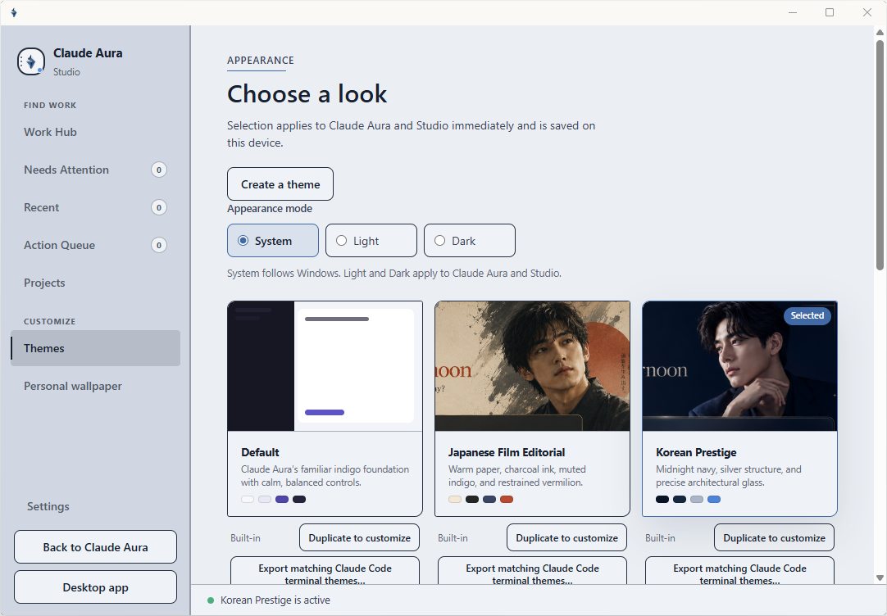
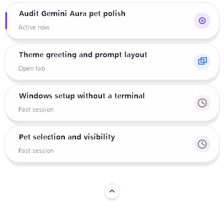
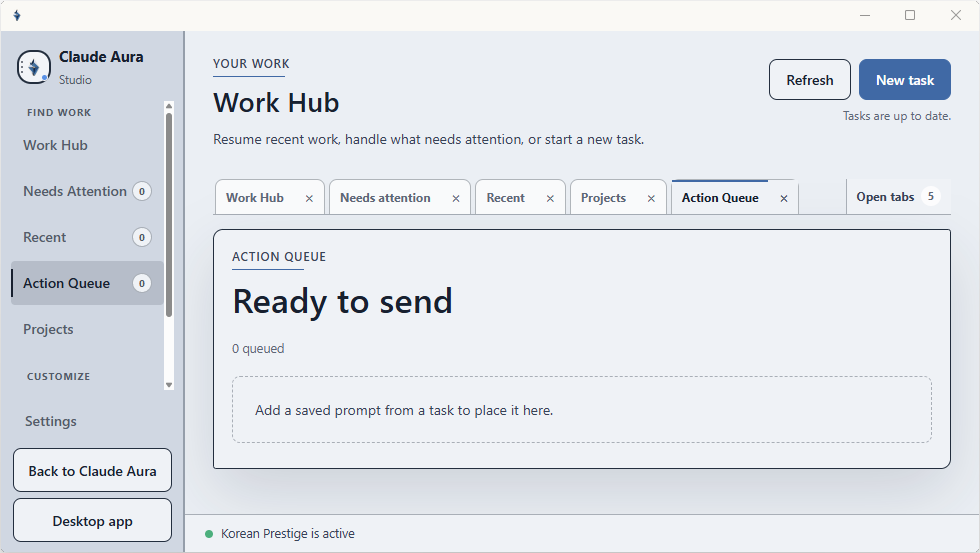

<a id="readme-top"></a>

# Claude Aura

<p align="center">
  <a href="../README.md">English</a> ·
  <a href="./README.zh-CN.md">简体中文</a> ·
  <strong>繁體中文</strong> ·
  <a href="./README.hi.md">हिंदी</a> ·
  <a href="./README.es.md">Español</a> ·
  <a href="./README.fr.md">Français</a> ·
  <a href="./README.id.md">Bahasa Indonesia</a> ·
  <a href="./README.ja.md">日本語</a> ·
  <a href="./README.ko.md">한국어</a> ·
  <a href="./README.pt-BR.md">Português (Brasil)</a> ·
  <a href="./README.de.md">Deutsch</a> ·
  <a href="./README.it.md">Italiano</a> ·
  <a href="./README.vi.md">Tiếng Việt</a> ·
  <a href="./README.pl.md">Polski</a> ·
  <a href="./README.tr.md">Türkçe</a>
</p>

<p align="center">
  <strong>讓 Claude 即時網站成為更順手的 Windows 工作空間。</strong><br>
  8 個主題 · 浮動寵物 · 真正的分頁 · 儀表板 · 可還原的本機樣式
</p>

<p align="center">
  <a href="#getting-started">開始使用</a> ·
  <a href="#feature-tour">60 秒看懂 Aura</a> ·
  <a href="#create-a-custom-theme">建立主題</a> ·
  <a href="../docs/TROUBLESHOOTING.md">疑難排解</a> ·
  <a href="../SECURITY.md">安全性</a>
</p>

<p align="center">
  如果 Claude Aura 對你有幫助，歡迎<a href="https://github.com/kaihuang1425/claude-aura"><strong>在 GitHub 上幫專案按個 Star</strong></a>。
</p>

<p align="center">
  <br>
  <sub>實際安裝的 Aura 畫面 · 儀表板、目的地分頁與本機工作階段看板</sub>
</p>

<a id="feature-tour"></a>
## 60 秒看懂 Aura

Aura 會開啟真正的 `claude.ai`，再於外圍加上本機工作空間。先選一種喜歡的
外觀；需要控制功能時使用 Aura 按鈕；不同對話留在各自的分頁；想繼續之前的
工作，就回到 儀表板。

### 1. 選一種外觀

開啟 Studio，即可切換 8 個內建主題。選取的主題會同時套用到 Claude Aura
與 Studio，支援淺色和深色模式；想調整時可先複製，不會覆寫內建版本。

<p align="center">
  <br>
  <sub>實際安裝的 Aura 畫面 · Studio 主題圖庫</sub>
</p>

### 2. 認識 Aura 按鈕

48 × 48 的浮動圓形按鈕會完整留在 Aura 視窗內。第一次開啟時，按鈕旁的引導卡
會將 **Claude Aura Web** 標示為使用即時 `claude.ai` 的工作空間，並區分獨立、
仍在實驗階段的 **Claude Aura Desktop** 方向。按一下可開啟 Studio；按右鍵可
查看快速操作；按住拖曳則可移動按鈕。

### 3. 讓寵物陪著你

在 Studio 選擇 Nori、Pip 或 Moss，再顯示或隱藏獨立執行的本機寵物；隱藏後
不會忘記原本的選擇。寵物的工作階段清單只顯示受限的本機狀態，可回到已知的
Aura 分頁或曾觀察到的工作階段，不會取得對話內文。

<p align="center">
  
  &nbsp;&nbsp;
  
  &nbsp;&nbsp;
  
</p>

<p align="center">
  <br>
  <sub>實際安裝的 companion 畫面 · 本機工作階段清單</sub>
</p>

### 4. 用分頁保留每段工作

儀表板 固定留在分頁列；使用者開啟的 Claude 頁面則排在同一列。Studio 也用
相同方式呈現「最近」、「專案」和「操作佇列」等目的地，切換位置時不會取代
原本正在使用的頁面。

<p align="center">
  <br>
  <sub>實際安裝的 Aura 畫面 · 分頁式操作佇列</sub>
</p>

### 5. 回到 儀表板 繼續

儀表板 會把 Aura 觀察到的工作階段分成**進行中**、**已開啟**和**過去**。
按下卡片時，Aura 會沿用已開啟的分頁，或重新開啟已知且符合規則的網址。
看板只儲存本機路由與狀態中繼資料，不儲存對話內容；最新要求的圖示也不會
把整個目標誤判為已完成。

<p align="center">
  <br>
  <sub>實際安裝的 Aura 畫面 · 儀表板</sub>
</p>

<p align="center"><sub>以上都是實際安裝的 Aura 畫面，只能證明截圖中顯示的產品介面；更新後的版本仍須重新完成即時驗收。</sub></p>

> **獨立專案。** Claude Aura 是非官方專案，與 Anthropic PBC 沒有合作、
> 認可、贊助或核准關係。Aura 顯示 `claude.ai` 即時網站；本專案不提供
> Claude 服務，也不會修改 Anthropic 安裝在電腦上的應用程式。Claude、
> Anthropic 和相關名稱及標誌均屬 Anthropic PBC 所有。本專案授權不包含
> 這些素材的任何權利。

<details>
<summary><strong>公開或商業發布的商標說明</strong></summary>

> **公開或商業發布前請留意：** Anthropic 現行的
> [商標使用準則](https://www.anthropic.com/legal/trademark-guidelines)
> 規定，使用其名稱與標誌前必須取得核准，且不得改造標誌。免責聲明不等於
> 取得許可。若發布版本保留 **Claude Aura** 名稱或經主題化的 Claude
> 文字標誌，必須先取得書面許可，並接受適當的法律審查。

</details>

<a id="contents"></a>
<details>
<summary><strong>目錄</strong></summary>

- [Claude Aura](#claude-aura)
  - [60 秒看懂 Aura](#60-秒看懂-aura)
  - [為什麼選 Aura](#為什麼選-aura)
  - [開始使用](#開始使用)
    - [系統需求](#系統需求)
    - [安裝](#安裝)
    - [解除安裝](#解除安裝)
  - [主題展示](#主題展示)
    - [日系電影編輯風](#日系電影編輯風)
    - [日系偶像](#日系偶像)
    - [韓系偶像](#韓系偶像)
  - [使用 Aura](#使用-aura)
  - [建立自訂主題](#建立自訂主題)
  - [Aura 如何運作](#aura-如何運作)
  - [安全性與隱私權](#安全性與隱私權)
  - [開發藍圖](#開發藍圖)
  - [支援與說明文件](#支援與說明文件)
    - [說明文件索引](#說明文件索引)
  - [公益支持](#公益支持)
  - [授權與聲明](#授權與聲明)
  - [致謝](#致謝)

</details>

<a id="about-claude-aura"></a>
## 為什麼選 Aura

- **使用 Claude 即時網站。** Aura 保留真正的介面與原生控制項，不會以重建畫面取代它們。
- **變更只留在本機，而且可隨時還原。** Aura 不需要修改 Claude Desktop 就能套用本機樣式；按一下 **原始外觀**，即可移除 Aura 的顯示層。
- **從 8 個內建主題開始。** 每個主題都可作為穩定、唯讀的個人化工作空間起點。
- **建立主題時不覆寫原始檔案。** Claude Aura Studio 支援本機配色、字體、形狀、效果與美術素材。
- **用真正的分頁保留 Claude 工作。** 儀表板 固定顯示；使用者開啟的頁面會繼續使用各自的 WebView2 控制項與本機分頁中繼資料。
- **從 儀表板 繼續。** 進行中、已開啟和過去的工作階段來自加密且不含內文的本機記錄，只會重新開啟已知且符合規則的網址。
- **帶上寵物，不帶上另一個內容讀取器。** Aura 控制獨立的本機寵物 companion，只分享受限的工作階段狀態，不分享提示詞或對話內文。

Aura 0.3 目前只會替即時網站套用主題，還不會替 Claude Desktop 原生 Code
介面或 Claude Code 終端機套用主題；Aura 裡的一般對話也不會因此取得本機專案
存取權。正式發行前，Aura Code 必須完成一項未通過就不得發行的驗證：在即時
`claude.ai/code` 中，透過官方
[Remote Control](https://code.claude.com/docs/en/remote-control) 操作已套用主題的
本機 Claude Code 工作階段；受限環境則以相符的終端機主題匯出作為替代，而且
全程不修改 Claude Desktop。

<details>
<summary><strong>完整功能範圍與限制</strong></summary>

Claude Aura 會在獨立的 Microsoft Edge WebView2 視窗中開啟真正的
`claude.ai` 網站，並套用本機視覺主題。它適合想打造個人化工作空間，
但不想修改 Claude Desktop，也不想以螢幕截圖取代即時介面的人。

| Aura 會做的事 | Aura 不會做的事 |
| --- | --- |
| 在 WebView2 中載入即時 `claude.ai` 介面 | 以重建的介面取代 Claude |
| 套用可還原的本機樣式 | 修改 Claude Desktop、`app.asar`、Windows 套件或程式碼簽章 |
| 提供 8 個內建主題 | 變更 Claude 帳號、對話、API 金鑰、模型或服務提供者設定 |
| 提供 Studio 來建立本機自訂主題 | 宣稱是 Anthropic 產品或官方主題系統 |
| 在應用程式內提供 **原始外觀** | 關閉樣式時刪除已儲存的主題 |

</details>

<p align="right">(<a href="#readme-top">回到頂端</a>)</p>

<a id="getting-started"></a>
## 開始使用

### 系統需求

- Windows 10 或 Windows 11
- 網路連線與 Claude 帳號
- [Node.js 22 或更新版本](https://nodejs.org/en/download)
- [Microsoft Edge WebView2 Runtime](https://developer.microsoft.com/en-us/microsoft-edge/webview2/)

大多數目前使用中的 Windows 電腦都已安裝 WebView2。如果 Aura 無法開啟
瀏覽器視窗，請安裝或修復 Evergreen WebView2 Runtime，然後再試一次。
Claude Desktop 為選用程式，會繼續以獨立應用程式執行。

### 安裝

開啟 [最新發行版本](https://github.com/kaihuang1425/claude-aura/releases)，
選擇下列其中一種方式。兩種方式都會為目前的 Windows 帳戶安裝相同版本。

| 方式 | 適用情況 | 下載項目 |
| --- | --- | --- |
| **未簽署的 Setup** | 想使用較簡單的引導式安裝程式，而且 Windows 能正常開啟該檔案 | `Claude-Aura-Setup-v<version>-UNSIGNED.exe`、對應的 `.sha256` 與 `.manifest.json` |
| **ZIP + CMD 備用方式** | Windows 對未簽署的 Setup 顯示警告或加以封鎖，或偏好可閱讀的原始碼指令碼 | `claude-aura-v<version>.zip` 與其 `.sha256` |

#### 方式 1 — 未簽署的 Setup

1. 在 **Assets** 下載 `-UNSIGNED.exe`、對應的 `.sha256` 與
   `.manifest.json`。不要使用 GitHub 自動產生的 **Source code** 壓縮檔。
2. 比對 Setup 檔案的 SHA-256 與兩個配套檔案中的值。只要有任何一個值
   不同，請停止安裝並刪除這些下載項目。
3. 開發者沒有程式碼簽署憑證，因此 Windows 無法驗證此安裝程式的發行者。
   若 Windows 顯示警告或加以封鎖，請勿略過警告，改用方式 2。
4. 若檔案能正常開啟，請依照 Setup 的指示操作。安裝程式會檢查 Node.js
   與 WebView2、將 Aura 安裝到 `%LOCALAPPDATA%\ClaudeAura`、新增
   **Installed apps** 項目與捷徑，然後開啟 Aura。

#### 方式 2 — ZIP + CMD 備用方式

1. 在 **Assets** 下載 `claude-aura-v<version>.zip` 及其配套的
   `.sha256`。不要使用 GitHub 自動產生的 **Source code** 壓縮檔。
2. 比對 ZIP 的 SHA-256 與配套檔案中的值。若兩者不同，請停止安裝並
   刪除這兩個檔案。
3. 選擇 **Extract all**。在解壓縮後的 `claude-aura` 資料夾中按兩下
   **Install Claude Aura.cmd**。不要直接從 ZIP 預覽視窗執行。
4. 可閱讀的 CMD/PowerShell 安裝程式會檢查 Node.js 與 WebView2、安裝
   Aura、建立捷徑並開啟 Aura。此方式不提供 Authenticode 發行者身分，
   也不會新增 **Installed apps** 項目。

透過任一方式安裝後，若 `claude.ai` 要求登入，請在 Aura 內登入。點選浮動
的 Aura 按鈕，選擇 **Open Studio**，再選擇 **Themes**。

不含 `-UNSIGNED` 的 `Claude-Aura-Setup-v<version>.exe` 是另一種已簽署
安裝方式，必須顯示該發行說明所列的發行者。以 `-UNSIGNED-DEV.exe`
結尾的檔案絕不會公開發行。

安裝不會修補或取代 Claude Desktop。

<details>
<summary><strong>安裝程式行為、應用程式位置與解除安裝</strong></summary>

兩種方式都不會要求系統管理員權限，會檢查必要元件並執行 Aura 受保護的
應用程式樹置換。應用程式檔案會安裝到：

```text
%LOCALAPPDATA%\ClaudeAura\app
```

它會在開始選單與桌面建立 **Claude Aura**、**Claude Aura Studio** 及
解除安裝捷徑。主題設定與登入資料會和應用程式分開儲存，因此重新安裝 Aura
不會擅自覆蓋這些資料。原生 Setup 會新增 **Installed apps** 項目與原生
解除安裝程式；ZIP/CMD 方式則會保留原始碼指令碼解除安裝捷徑。

開發者可複製此存放庫，並建立名稱明確的未簽署開發用安裝程式，在本機進行
檢查。此建置與名稱明確的公開未簽署 Setup 不同。建置指令、固定編譯器、
驗證門檻與發行清單皆記載於
[Windows installer guide](../docs/WINDOWS_INSTALLER.md)。

### 解除安裝

先在浮動的 Aura 按鈕上按滑鼠右鍵，然後選擇 **Exit Claude Aura**。
若使用 ZIP 安裝，請開啟 **Start > Claude Aura > Uninstall Claude Aura**，
或在解壓縮後的發行版本中按兩下 **Uninstall Claude Aura.cmd**。若透過
任一原生 Setup 安裝，也可選擇 **Settings > Apps > Installed apps >
Claude Aura > Uninstall**。若已有註冊的原生解除安裝程式，`.cmd` 會將
操作交給該程式。只要 Aura 仍在執行，解除安裝程式就不會繼續。

預設情況下，解除安裝會移除 Aura 應用程式與捷徑，但保留本機主題設定與
Aura 的獨立 WebView 登入設定檔，方便日後重新安裝。解除安裝程式會在刪除
這些資料夾前再次確認。選擇刪除後，Aura 的本機登入工作階段也會移除；
Claude Desktop、使用者的 Anthropic 帳戶與伺服器端帳戶資料不會受到影響。

</details>

<p align="right">(<a href="#readme-top">回到頂端</a>)</p>

<a id="theme-showcase"></a>
## 主題展示

下方以「新對話」與「對話」參考圖呈現 Aura 的視覺系統；本 README 頂端已展示
「日系電影編輯風」的新對話預覽。

**預設 · 日系電影編輯風 · 韓系精品 · 卡通工作室 · 動畫暮光 · 自習圖書館 · 日系偶像 · 韓系偶像**

### 日系電影編輯風

暖色紙張、炭黑墨色、低彩度靛藍與節制的朱紅色。

<details>
<summary>查看對話畫面</summary>

<p align="center">
  <br>
  <sub>深色 · 對話 · 使用者提供的說明文件展示圖</sub>
</p>

</details>

### 日系偶像

暖奶油色、柔粉色、玫瑰色、珠光淡紫色與細緻的緞帶細節。

<p align="center">
  <br>
  <sub>淺色 · 新對話 · 使用者提供的說明文件展示圖</sub>
</p>

<details>
<summary>查看對話畫面</summary>

<p align="center">
  <br>
  <sub>淺色 · 對話 · 使用者提供的說明文件展示圖</sub>
</p>

</details>

### 韓系偶像

冷白色、長春花藍、全像銀色與層次分明的音樂玻璃質感。

<p align="center">
  <br>
  <sub>淺色 · 新對話 · 使用者提供的說明文件展示圖</sub>
</p>

<details>
<summary>查看對話畫面</summary>

<p align="center">
  <br>
  <sub>淺色 · 對話 · 使用者提供的說明文件展示圖</sub>
</p>

</details>

<details>
<summary><strong>參考圖狀態與重複使用界線</strong></summary>

> **參考圖說明：** 這些由使用者提供的圖片用來呈現預期的視覺方向。
> 圖片可能含有示意用的介面內容，不是即時驗收證據，也不能證明目前
> `claude.ai` 的實際行為。這些圖片不是主題背景、不得匯入 Aura，且不會
> 包含在發行版安裝程式中。
>
> 預覽圖含有第三方產品介面、名稱或標誌，以及人物肖像風格的美術素材。
> 收錄這些圖片不代表取得重複使用的權利。進一步發布或轉散布前，請先確認
> 適用的介面、商標、美術素材與肖像權利。

</details>

<a id="built-in-themes"></a>
<details>
<summary><strong>所有內建主題與固定 ID</strong></summary>

Aura 依固定順序提供 8 個內建主題：

| # | 主題 | 固定 ID |
| ---: | --- | --- |
| 1 | 預設 | `default` |
| 2 | 日系電影編輯風 | `japanese-film-editorial` |
| 3 | 韓系精品 | `korean-prestige` |
| 4 | 卡通工作室 | `cartoon-studio` |
| 5 | 動畫暮光 | `anime-twilight` |
| 6 | 自習圖書館 | `study-library` |
| 7 | 日系偶像 | `japanese-idol` |
| 8 | 韓系偶像 | `korean-idol` |

內建主題為唯讀。想要自訂時，Studio 會建立可編輯的副本。

</details>

<p align="right">(<a href="#readme-top">回到頂端</a>)</p>

<a id="use-aura"></a>
## 使用 Aura

| 操作 | 功能 |
| --- | --- |
| 按一下浮動的 Aura 按鈕 | 開啟 Claude Aura Studio |
| 在浮動的 Aura 按鈕上按右鍵 | 開啟 Studio、操作佇列、寵物、外觀與 Claude Desktop 的快速操作 |
| 拖曳浮動的 Aura 按鈕 | 移動完整的圓形控制項，並讓它留在 Aura 視窗內 |
| **儀表板** | 顯示不含內文的進行中、已開啟與過去工作階段卡片，並回到已知的 Aura 網址 |
| 主分頁列的 **+** | 開啟另一個真正的 Claude 頁面，不取代目前的分頁 |
| **主題** | 開啟內建圖庫，並儲存選取的主題 |
| **寵物** | 選擇 Nori、Pip 或 Moss，並顯示、隱藏或開啟獨立寵物 companion 的設定 |
| **建立主題** | 建立或編輯由 Aura 管理的自訂主題 |
| **個人桌布 > 選擇桌布…** | 選取本機圖片，與使用中的主題分開設定 |
| **清除桌布** | 停止使用桌布，但不刪除原始圖片檔案 |
| **原始外觀** | 移除 Aura 樣式，顯示未套用所選主題的即時網站 |
| **套用主題** | 使用原始外觀後，還原已儲存的 Aura 主題 |
| **開啟桌面版** | 開啟 Claude Desktop，不對它進行任何修改 |

選取的主題會在 Aura 重新啟動後繼續使用。**原始外觀**只會關閉 Aura
的顯示層，不會刪除已儲存的主題或自訂美術素材。**預設**是 Aura
的第一個內建主題，和原始外觀不同。

浮動的 Aura 啟動按鈕會維持精簡的圓形控制項。預設按一下會開啟 Studio；
右鍵選單保留次要操作；拖曳時，連同透明外圍在內的完整控制項都不會離開視窗。

個人桌布會持續連結原始圖片路徑。移動或刪除該檔案後，桌布就無法使用。
透過編輯器匯入的主題美術素材採用不同方式處理：Studio 會將素材複製或
轉換到 Aura 管理的主題資料夾。

<p align="right">(<a href="#readme-top">回到頂端</a>)</p>

<a id="create-a-custom-theme"></a>
## 建立自訂主題

1. 從桌面或開始功能表開啟 **Claude Aura Studio**。
2. 開啟 **建立主題** 並選擇 **自訂預設主題**；或開啟 **主題**、選擇
   內建主題，再選擇 **複製後自訂**。
3. 調整淺色與深色配色、字體、形狀、效果和本機美術素材。
4. 在 Studio 預覽中檢查新對話與對話版面。
5. 修正任何對比或檔案大小警告。
6. 選擇 **儲存主題**。

內建檔案絕不會被覆寫。草稿若變成無效狀態，仍可繼續編輯；Aura 則會
繼續顯示上一個有效版本。

匯入的 PNG、JPEG、WebP 或 AVIF 美術素材會在本機轉換為符合容量限制的
WebP 素材。Studio 不會將來源檔案路徑儲存在主題中。完整的編輯器與主題規格
請參閱[主題套件規格](../docs/THEME_KIT_SPEC.md)。

功能可用時，Studio 可以把實際 Aura 視窗的畫面擷取當作編輯背景。
畫面擷取可能含有對話內容，只會在目前的編輯工作階段中存放於記憶體，
絕不寫入磁碟。

<p align="right">(<a href="#readme-top">回到頂端</a>)</p>

<a id="built-with"></a>
## Aura 如何運作

| 組成 | 用途 |
| --- | --- |
| Windows PowerShell 與 WinForms | 安裝程式、Aura 視窗、Studio、捷徑與本機控制項 |
| Microsoft Edge WebView2 | 顯示真正的 `claude.ai` 網站 |
| Node.js 22+ | 驗證主題並建立本機主題樣式 |
| 本機 HTML、CSS、JavaScript、SVG 與 WebP | 提供 Aura 樣式與內建主題素材 |

本專案沒有 npm 套件或執行階段字型相依性。

<p align="right">(<a href="#readme-top">回到頂端</a>)</p>

<a id="safety-and-privacy"></a>
## 安全性與隱私權

- Aura 會透過 Microsoft Edge WebView2 載入真正的 `claude.ai` HTTPS 網站。
- 登入服務提供者的頁面不會套用主題。
- Aura 不會開啟遠端偵錯連接埠，也不會修改 Claude Desktop。
- 主題檔案與匯入的美術素材會留在 Aura 管理的本機資料夾。
- 即時網頁仍會照常連線至 Anthropic。
- WebView 設定檔含有登入工作階段資料，請妥善保護。
- Studio 的即時頁面畫面擷取只會在編輯工作階段中留在記憶體，不會儲存到磁碟。
- 請勿選擇含敏感內容的背景圖片；即時頁面在技術上可存取其處理程序內的
  DOM 資料。
- 使用即時服務時，仍須遵守 Anthropic 現行的
  [消費者條款](https://www.anthropic.com/terms)與
  [使用政策](https://www.anthropic.com/legal/aup)。

請閱讀 [SECURITY.md](./SECURITY.md) 瞭解信任邊界；若需要登入、載入、
主題、圖片或 WebView2 相關協助，請參閱
[疑難排解](../docs/TROUBLESHOOTING.md)。

<a id="local-data"></a>
<details>
<summary><strong>本機資料夾與解除安裝保留項目</strong></summary>

Aura 會分開存放應用程式、設定、主題、草稿與瀏覽器設定檔：

| 路徑 | 內容 |
| --- | --- |
| `%LOCALAPPDATA%\ClaudeAura\app` | 已安裝的 Aura 應用程式 |
| `%LOCALAPPDATA%\ClaudeAura\data` | 設定、記錄檔與 Aura 管理的本機狀態 |
| `%LOCALAPPDATA%\ClaudeAura\data\themes` | 已儲存的自訂主題與衍生美術素材 |
| `%LOCALAPPDATA%\ClaudeAura\data\theme-drafts` | Studio 編輯中的草稿 |
| `%LOCALAPPDATA%\ClaudeAura\webview` | Aura 專用的 WebView2 登入設定檔 |

請像保護任何已登入的瀏覽器設定檔一樣保護 `webview` 資料夾，不要發布或分享。
解除安裝預設會保留 `data` 與 `webview`；只有在確定要一併清除本機設定、主題和
專用登入設定檔時，才選擇明確的移除選項。

</details>

<p align="right">(<a href="#readme-top">回到頂端</a>)</p>

<a id="roadmap"></a>
## 開發藍圖

- [x] 獨立的 Windows WebView2 伴隨工具，以及可還原的 **原始外觀**
- [x] 8 個順序固定的內建主題，支援淺色與深色外觀
- [ ] 完成並檢查免寫程式碼的 Studio 視覺化編輯器
- [ ] 完成並驗收 Aura Code，使其透過官方 Remote Control 操作本機 Claude Code，
      並提供相符的終端機主題匯出
- [ ] 發布 30 分鐘自訂主題教學
- [ ] 執行最後一輪發行驗證

公開進度請參閱
[實作報告](../docs/IMPLEMENTATION_REPORT.md)與
[儲存庫 Issues](https://github.com/kaihuang1425/claude-aura/issues)。
參考預覽絕不能取代規定的 Aura 即時驗收證據。

<p align="right">(<a href="#readme-top">回到頂端</a>)</p>

<a id="support"></a>
## 支援與說明文件

請先查看[疑難排解](../docs/TROUBLESHOOTING.md)。若有可重現的 Bug 或功能需求，
請使用[儲存庫的 Issues 頁面](https://github.com/kaihuang1425/claude-aura/issues)。

回報 Bug 時，請附上 Windows、Node.js 與 WebView2 版本、目前使用的主題 ID，
以及重現問題的步驟。分享記錄檔前請先檢查內容；Aura 的 UI 記錄檔位於：

```text
%LOCALAPPDATA%\ClaudeAura\data\aura-ui.log
```

安全性問題請依 [SECURITY.md](./SECURITY.md) 說明，透過儲存庫的非公開
安全性公告回報。

### 說明文件索引

- [疑難排解](../docs/TROUBLESHOOTING.md)
- [安全性與信任邊界](./SECURITY.md)
- [主題設定指南](../docs/THEMING.md)
- [主題套件規格](../docs/THEME_KIT_SPEC.md)
- [實作報告](../docs/IMPLEMENTATION_REPORT.md)
- [檔案清單](../docs/FILE_MANIFEST.md)
- [貢獻指南](./CONTRIBUTING.md)
- [儲存庫 Issues](https://github.com/kaihuang1425/claude-aura/issues)

<a id="contributing"></a>
<details>
<summary><strong>貢獻檢查與專案界線</strong></summary>

提交變更前，請執行必要的檢查：

```powershell
npm run check
npm run verify:cycle
```

若只要稽核單一內建主題：

```powershell
node scripts/theme-cli.mjs qa <id>
```

請遵守以下專案界線：

- 不要新增 npm 或執行階段字型相依性。
- 8 個固定主題 ID 與順序不得變更。
- 不要將重建的 Claude 介面 HTML 當作產品內容發布。
- 不要將參考圖片當成 UI 驗收證據。
- 貢獻媒體檔案時，請附上來源、授權與散布資訊。

變更主題系統或發行版檔案樹前，請先閱讀
[CONTRIBUTING.md](./CONTRIBUTING.md)、
[主題設定指南](../docs/THEMING.md)、
[主題套件規格](../docs/THEME_KIT_SPEC.md)與
[檔案清單](../docs/FILE_MANIFEST.md)。

</details>

<p align="right">(<a href="#readme-top">回到頂端</a>)</p>

<a id="charitable-support"></a>
## 公益支持

Claude Aura 不接受支付給專案所有者的個人捐款、小費、贊助、推薦報酬或其他
經濟支持。專案所有者目前在英國受
[Student 路線簽證條件](https://www.gov.uk/guidance/immigration-rules/immigration-rules-appendix-student)
約束；除少數例外情況外，該條件禁止自僱或從事商業活動。為避免與這些條件
發生任何潛在衝突，在條件適用期間，所有者無法接受與專案相關的捐款或小費。

覺得 Claude Aura 實用的話，[替儲存庫按個 Star](https://github.com/kaihuang1425/claude-aura)，
就是最簡單的非金錢支持方式。

<details>
<summary><strong>Student 路線背景、獨立非營利組織與捐款界線</strong></summary>

若想支持相關公益工作，可直接向以下任一獨立非營利組織捐款：

- [英國國際救援委員會（IRC UK）](https://help.rescue-uk.org/donate-web)
  協助受衝突與災害影響的人們，包括在英國重建生活的難民。國際救援委員會
  也參與 Claude Corps。
- [CodePath](https://www.every.org/codepath) 提供免費的技術教育，並以
  Anthropic 非營利合作夥伴的身分參與
  [Claude Corps](https://www.anthropic.com/news/claude-corps)。

以上連結會直接前往第三方。Claude Aura 及其所有者不會收集、處理、控制或
接收任何捐款，也不會從中獲得經濟利益。捐款處理與收據均由相關組織自行負責。
列出這些組織不代表其與 Claude Aura 存在合作、贊助、認可或官方募款關係。

</details>

<a id="license-and-notices"></a>
## 授權與聲明

專案自行撰寫的軟體依 [MIT License](./LICENSE) 散布。另請閱讀
[NOTICE.md](./NOTICE.md)與
[THIRD_PARTY_NOTICES.md](./THIRD_PARTY_NOTICES.md)。

MIT License 不授予 Anthropic 名稱、標誌、介面、網站或應用程式的任何權利。
展示圖說也不授予圖中介面、美術素材、名稱、標誌或人物肖像的重複使用權。
各檔案的來源與權利聲明仍然適用。

請查閱現行的
[Anthropic 商標使用準則](https://www.anthropic.com/legal/trademark-guidelines)
與[消費者條款](https://www.anthropic.com/terms)。發布、修改或轉散布受保護的
名稱、標誌、介面擷取畫面、美術素材或可辨識人物肖像前，請向相關權利人取得
一切必要許可。本儲存庫與 README 不授予這些許可。

<a id="acknowledgments"></a>
## 致謝

- [Codex Dream Skin](https://github.com/Fei-Away/Codex-Dream-Skin) 為原始
  loopback 驗證流程與親切易懂的展示方式提供了參考。
- [claude-desktop-bin](https://github.com/patrickjaja/claude-desktop-bin)
  為早期的語意主題對應方式提供了參考。
- [Best README Template](https://github.com/othneildrew/Best-README-Template)
  為本 README 以讀者為優先的架構提供了參考。
- Microsoft Edge WebView2 提供內嵌瀏覽器執行階段。

詳細授權與來源記錄於
[THIRD_PARTY_NOTICES.md](./THIRD_PARTY_NOTICES.md)。列入致謝不代表有合作、
贊助或認可關係。

<p align="right">(<a href="#readme-top">回到頂端</a>)</p>
